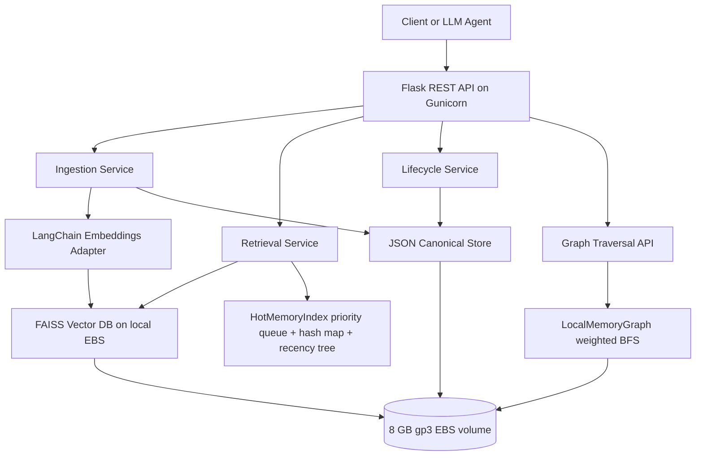

# AegisMem

**LLM Agent Memory System | Python, LangChain, Flask, AWS, Vector DB, REST API**

AegisMem is a memory system for long-running LLM agents. It supports ingestion, semantic retrieval, exact hash-key lookup, update, deletion, and graph traversal over related memories.

AegisMem is designed with a microservices-style architecture; deployed as a single-node Free Tier instance for demonstration.

## Architecture



Editable diagram source: `architecture.drawio`.

## Audit Summary

| Feature | Status | Evidence / fix |
| --- | --- | --- |
| Python + Flask REST API | Present | Added `apps/flask_app.py` with lifecycle routes for ingest, retrieve, hash lookup, update, delete, and graph traversal. |
| LangChain integration | Present | Added `adapters/embeddings/langchain_adapter.py` implementing the LangChain `Embeddings` interface. |
| Vector DB | Present | Added `adapters/vector_store/faiss_store.py` with persistent FAISS index files. Docker installs `faiss-cpu`, never GPU FAISS. |
| Semantic retrieval pipeline | Present | `services/flask_memory_service.py` wires embedding -> FAISS upsert/search -> record hydration. |
| Graph-based retrieval | Present | `adapters/graph_store/memory_graph.py` implements persistent weighted BFS traversal. |
| Hash-indexed retrieval | Present | `adapters/relational_store/json_store.py` maintains SHA-256 exact lookup indexes. |
| Priority queue, hash map, tree | Present | `services/cache_index.py` uses `heapq`, dict hash maps, and a sorted recency tree for hot-memory indexing. |
| Microservices-style structure | Present | API, services, adapters, graph, vector, and storage concerns are split into separate modules. |
| Structured documentation | Present | This README documents architecture, API, Docker, AWS deployment, teardown, and cost risks. |

## Local Setup

```bash
git clone https://github.com/Ajay-quan/AegisMem.git
cd AegisMem
python3 -m venv .venv
source .venv/bin/activate
pip install -r requirements.txt
export AEGISMEM_DATA_DIR=$PWD/data
export AEGISMEM_EMBEDDING_BACKEND=mock
flask --app apps.flask_app run --host 0.0.0.0 --port 8000
```

Use `AEGISMEM_EMBEDDING_BACKEND=sentence_transformers` to run local sentence-transformer embeddings. The Docker default is `mock` so a Free Tier instance does not download large models unless you opt in.

## Docker

```bash
docker build -t aegismem:free-tier .
docker run --rm -p 8000:8000 \
  -e AEGISMEM_DATA_DIR=/data/aegismem \
  -v "$PWD/data:/data/aegismem" \
  aegismem:free-tier
```

## API Examples

```bash
BASE=http://127.0.0.1:8000

curl -s "$BASE/health"

curl -s -X POST "$BASE/api/v1/memories" \
  -H "Content-Type: application/json" \
  -d '{"user_id":"alice","key":"python-pref","content":"Alice prefers Python and FAISS for local vector search.","importance_score":0.9}'

curl -s -X POST "$BASE/api/v1/retrieve" \
  -H "Content-Type: application/json" \
  -d '{"user_id":"alice","query":"local vector search","top_k":5}'

curl -s "$BASE/api/v1/memories/key/alice/python-pref"

curl -s -X PATCH "$BASE/api/v1/memories/MEMORY_ID" \
  -H "Content-Type: application/json" \
  -d '{"content":"Alice prefers Flask APIs and FAISS retrieval."}'

curl -s "$BASE/api/v1/graph/MEMORY_ID?depth=2"
curl -s -X DELETE "$BASE/api/v1/memories/MEMORY_ID"
```

Expected response shapes:

- Ingest: `{ "memory": { "memory_id", "user_id", "content", "key" } }`
- Retrieve: `{ "query", "results": [{ "rank", "memory_id", "content", "score" }], "total_found" }`
- Hash lookup: `{ "lookup": "sha256_hash_index", "memory": {...} }`
- Graph: `{ "memory_id", "related": [{ "memory_id", "distance", "path_score", "path" }] }`
- Delete: `{ "deleted": true, "memory_id": "..." }`


## Project Hardening Additions

The repo now includes the zero-cost polish items that make the project easier to defend:

- Optional API-key auth with `AEGISMEM_API_KEY` and `X-API-Key`.
- Structured validation errors for invalid request bodies, `top_k`, `depth`, empty content, and bad metadata/tags.
- Import/export endpoints for portable memory snapshots: `/api/v1/export` and `/api/v1/import`.
- Memory version history on update/delete: `/api/v1/memories/{memory_id}/versions`.
- Optional local persistent ChromaDB adapter via `AEGISMEM_VECTOR_STORE=chroma`; FAISS remains the default.
- Advisory file locking and atomic JSON persistence for safer single-node multi-worker writes.
- Built-in browser demo UI at `/`, plus `scripts/demo_flask_lifecycle.sh` for curl-based demos.
- Focused Flask and local component tests: `tests/api/test_flask_api.py`, `tests/unit/test_local_memory_components.py`.
- GitHub Actions CI: `.github/workflows/ci.yml`.
- Synthetic retrieval benchmark with 10 target memories plus 60 noisy distractors: `scripts/evaluate_memory_retrieval.py`.
- Generated benchmark results and charts under `docs/benchmarks` and `docs/assets`.
- Architecture paper: `docs/aegismem_architecture.md`.
- ADRs: `docs/adr/`.
- OpenAPI spec: `docs/api/openapi.yaml`.
- Seeded sample data: `examples/sample_memories.json`.

Latest local benchmark summary:

| Metric | Value |
| --- | ---: |
| Memories | 70 |
| Queries | 10 |
| Precision@1 | 1.0 |
| Precision@3 | 0.5 |
| Recall@5 | 0.9667 |
| MRR | 1.0 |
| Avg latency | 10.3402 ms |
| P95 latency | 10.7547 ms |


Run the benchmark locally:

```bash
python scripts/evaluate_memory_retrieval.py --output-dir docs/benchmarks --asset-dir docs/assets
```

Run the lifecycle demo after starting the Flask app:

```bash
BASE=http://127.0.0.1:8000 ./scripts/demo_flask_lifecycle.sh
# If AEGISMEM_API_KEY is set on the server:
API_KEY=dev-secret BASE=http://127.0.0.1:8000 ./scripts/demo_flask_lifecycle.sh
```

Optional auth and Chroma mode:

```bash
export AEGISMEM_API_KEY=dev-secret
export AEGISMEM_VECTOR_STORE=chroma  # optional; default is faiss
```

## AWS Free Tier Deployment Runbook

Do not create any AWS resource until you verify Free Tier eligibility.

Check eligibility in Console: **Billing and Cost Management -> Free Tier**. Confirm EC2 Linux hours are available for your account and region.

CLI cost check:

```bash
aws sts get-caller-identity
aws ce get-cost-and-usage \
  --time-period Start=$(date -u +%Y-%m-01),End=$(date -u +%Y-%m-%d) \
  --granularity MONTHLY \
  --metrics UnblendedCost
```

Create a $1 budget alert in Console: **Billing and Cost Management -> Budgets -> Create budget -> Cost budget -> Fixed -> $1 -> email alerts at 80% and 100%**.

CLI budget example:

```bash
ACCOUNT_ID=$(aws sts get-caller-identity --query Account --output text)
aws budgets create-budget \
  --account-id "$ACCOUNT_ID" \
  --budget '{"BudgetName":"aegismem-dollar-alert","BudgetLimit":{"Amount":"1","Unit":"USD"},"TimeUnit":"MONTHLY","BudgetType":"COST"}' \
  --notifications-with-subscribers '[{"Notification":{"NotificationType":"ACTUAL","ComparisonOperator":"GREATER_THAN","Threshold":80,"ThresholdType":"PERCENTAGE"},"Subscribers":[{"SubscriptionType":"EMAIL","Address":"YOUR_EMAIL@example.com"}]}]'
```

### EC2 Console Path

1. EC2 -> Key Pairs -> Create key pair -> RSA -> `.pem`.
2. EC2 -> Security Groups -> Create security group.
3. Inbound rules: SSH 22 from **My IP only**; HTTP 80 from `0.0.0.0/0`.
4. EC2 -> Launch Instance.
5. AMI: Amazon Linux 2023 or Ubuntu 22.04.
6. Instance type: `t2.micro`, or `t3.micro` only where explicitly Free Tier eligible.
7. Storage: 8 GB gp3 root volume, delete on termination.
8. Disable detailed monitoring.
9. Do not allocate Elastic IP.
10. Single region, single AZ.

Do not provision ALB, NLB, API Gateway, CloudFront, NAT Gateway, RDS, OpenSearch, managed Chroma, S3, or EFS.

### EC2 CLI Launch

```bash
REGION=us-east-1
KEY_NAME=aegismem-free-tier
SG_NAME=aegismem-free-tier-sg
MY_IP=$(curl -s https://checkip.amazonaws.com)/32
AMI_ID=ami-REPLACE_WITH_AMAZON_LINUX_2023_OR_UBUNTU_2204

aws ec2 create-key-pair --region "$REGION" --key-name "$KEY_NAME" \
  --query KeyMaterial --output text > "$KEY_NAME.pem"
chmod 400 "$KEY_NAME.pem"

VPC_ID=$(aws ec2 describe-vpcs --region "$REGION" --filters Name=is-default,Values=true --query 'Vpcs[0].VpcId' --output text)
SG_ID=$(aws ec2 create-security-group --region "$REGION" --group-name "$SG_NAME" --description "AegisMem Free Tier demo" --vpc-id "$VPC_ID" --query GroupId --output text)
aws ec2 authorize-security-group-ingress --region "$REGION" --group-id "$SG_ID" --protocol tcp --port 22 --cidr "$MY_IP"
aws ec2 authorize-security-group-ingress --region "$REGION" --group-id "$SG_ID" --protocol tcp --port 80 --cidr 0.0.0.0/0

INSTANCE_ID=$(aws ec2 run-instances --region "$REGION" \
  --image-id "$AMI_ID" \
  --instance-type t2.micro \
  --key-name "$KEY_NAME" \
  --security-group-ids "$SG_ID" \
  --block-device-mappings '[{"DeviceName":"/dev/xvda","Ebs":{"VolumeSize":8,"VolumeType":"gp3","DeleteOnTermination":true}}]' \
  --metadata-options 'HttpTokens=required' \
  --monitoring Enabled=false \
  --count 1 \
  --query 'Instances[0].InstanceId' --output text)
aws ec2 wait instance-running --region "$REGION" --instance-ids "$INSTANCE_ID"
PUBLIC_DNS=$(aws ec2 describe-instances --region "$REGION" --instance-ids "$INSTANCE_ID" --query 'Reservations[0].Instances[0].PublicDnsName' --output text)
echo "$PUBLIC_DNS"
```

### Install Docker and Run

Amazon Linux 2023:

```bash
ssh -i aegismem-free-tier.pem ec2-user@$PUBLIC_DNS
sudo dnf update -y
sudo dnf install -y docker git
sudo systemctl enable --now docker
sudo usermod -aG docker ec2-user
exit
```

Reconnect:

```bash
ssh -i aegismem-free-tier.pem ec2-user@$PUBLIC_DNS
git clone https://github.com/Ajay-quan/AegisMem.git
cd AegisMem
mkdir -p /opt/aegismem/data
sudo chown -R ec2-user:ec2-user /opt/aegismem
docker build -t aegismem:free-tier .
docker run -d --name aegismem --restart unless-stopped \
  -p 80:8000 \
  -e AEGISMEM_DATA_DIR=/data/aegismem \
  -e AEGISMEM_EMBEDDING_BACKEND=mock \
  -v /opt/aegismem/data:/data/aegismem \
  aegismem:free-tier
```

Ubuntu 22.04 uses `ubuntu@$PUBLIC_DNS` and `sudo apt-get install -y docker.io git` instead of `dnf`.

## Public Endpoint Test

```bash
BASE=http://$PUBLIC_DNS
curl -s "$BASE/health"

MEM1=$(curl -s -X POST "$BASE/api/v1/memories" -H "Content-Type: application/json" -d '{"user_id":"alice","key":"python-pref","content":"Alice prefers Python and FAISS for memory retrieval."}' | python3 -c 'import sys,json; print(json.load(sys.stdin)["memory"]["memory_id"])')
MEM2=$(curl -s -X POST "$BASE/api/v1/memories" -H "Content-Type: application/json" -d "{\"user_id\":\"alice\",\"key\":\"aws-pref\",\"content\":\"Alice deploys portfolio demos on AWS Free Tier.\",\"related_memory_ids\":[\"$MEM1\"]}" | python3 -c 'import sys,json; print(json.load(sys.stdin)["memory"]["memory_id"])')

curl -s -X POST "$BASE/api/v1/retrieve" -H "Content-Type: application/json" -d '{"user_id":"alice","query":"FAISS retrieval","top_k":5}'
curl -s "$BASE/api/v1/memories/key/alice/python-pref"
curl -s "$BASE/api/v1/graph/$MEM1?depth=2"
curl -s -X DELETE "$BASE/api/v1/memories/$MEM1"
```

Use the EC2 public IPv4 DNS directly. A free `nip.io` hostname is optional. Do not use Route 53 hosted zones because they cost money. HTTPS is optional; use Caddy with Let's Encrypt on the instance only if you need it.

## Teardown Runbook

```bash
aws ec2 terminate-instances --region "$REGION" --instance-ids "$INSTANCE_ID"
aws ec2 wait instance-terminated --region "$REGION" --instance-ids "$INSTANCE_ID"
aws ec2 delete-security-group --region "$REGION" --group-id "$SG_ID"
aws ec2 delete-key-pair --region "$REGION" --key-name "$KEY_NAME"
rm -f "$KEY_NAME.pem"
```

Check leftovers:

```bash
aws ec2 describe-addresses --region "$REGION"
aws ec2 describe-volumes --region "$REGION" --filters Name=status,Values=available
aws ec2 describe-instances --region "$REGION" --filters Name=instance-state-name,Values=running,stopped
```

Looks free but can cost money: unattached Elastic IPs, NAT Gateway, load balancers, RDS, OpenSearch, managed Chroma, EFS, more than 30 GB EBS total, orphaned volumes, data transfer out beyond the free allowance, CloudWatch detailed monitoring, excessive logs, and Route 53 hosted zones.

## GitHub About Topics

Set: `python`, `flask`, `langchain`, `aws`, `faiss`, `chromadb`, `vector-database`, `rest-api`, `llm`, `memory`.

## Resume Defensibility

- `Python, LangChain, Flask, AWS, Vector DB, REST API`: `apps/flask_app.py`, `adapters/embeddings/langchain_adapter.py`, `adapters/vector_store/faiss_store.py`, and the AWS EC2 runbook above.
- `scalable, distributed memory system`: the code is split by API, service, storage, vector, graph, and indexing boundaries; the README states the Free Tier deployment is single-node for demonstration.
- `FAISS/ChromaDB`: FAISS is wired in code; ChromaDB is pinned for future local persistent mode but no managed Chroma service is required.
- `semantic retrieval pipelines`: `FlaskMemoryService.ingest` and `FlaskMemoryService.retrieve` implement embedding, vector storage, similarity search, and return hydration.
- `microservices-style Flask REST API`: `apps/flask_app.py` exposes lifecycle endpoints over separated services/adapters.
- `graph-based and hash-indexed retrieval`: `LocalMemoryGraph.traverse` and `JsonMemoryStore.get_by_key`.
- `priority queues, hash maps, trees`: `HotMemoryIndex`.
- `deployable on AWS`: the Dockerfile and EC2 Free Tier runbook deploy the container on one instance with local EBS persistence.
