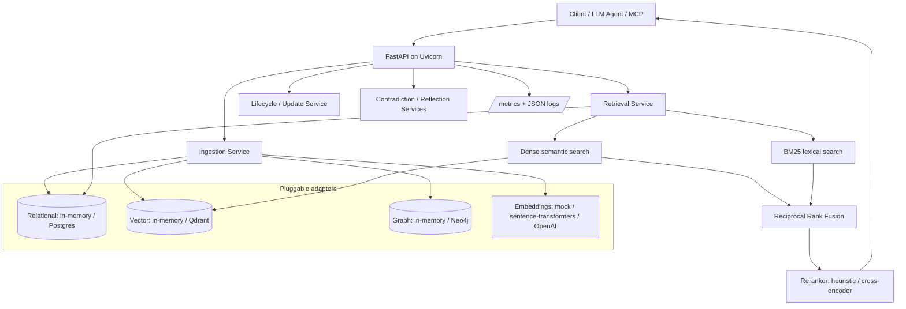
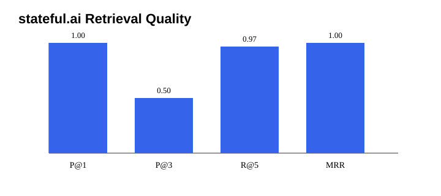
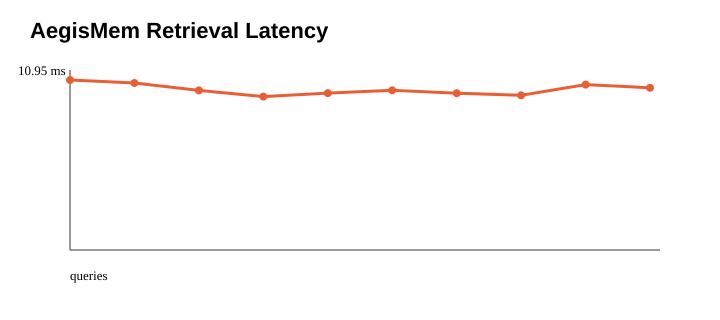

# AegisMem

**Persistent memory for long-running LLM agents** — hybrid retrieval, versioned lifecycle, contradiction detection, and an MCP server, built on a clean layered architecture (API → services → domain → adapters).

AegisMem stores agent observations and retrieves the right context later by combining **dense semantic search**, **sparse BM25 lexical search** (fused with Reciprocal Rank Fusion), recency/importance signals, and a second-stage reranker. It supports the full memory lifecycle: ingest, retrieve, update with version history, soft-delete, exact key lookup, and related-memory graph traversal.

## Two ways to run

AegisMem ships as one codebase with two entry points, and the docs say exactly what each needs:

| | **FastAPI service** (primary product) | **Flask demo** (single-file, AWS Free Tier) |
| --- | --- | --- |
| Run | `pip install -r requirements.txt` then `uvicorn apps.api.main:app` | `pip install -r requirements-flask-demo.txt` then `flask --app apps.flask_app run` |
| Infra needed | **None** — in-memory stores + mock embeddings by default | None — local FAISS + JSON |
| Scales to | Postgres + Qdrant + Neo4j + Redis via extras / docker-compose | Single node by design |
| Code | `apps/api/`, `services/`, `domain/`, `adapters/` | `apps/flask_app.py`, `services/flask_memory_service.py` |

The FastAPI service **boots end-to-end with zero external infrastructure** (in-memory relational, vector, and graph stores; deterministic mock embeddings) and swaps in production backends purely through configuration — nothing in the default path requires a database, queue, or vector service.

```bash
pip install -r requirements.txt
uvicorn apps.api.main:app --reload          # http://127.0.0.1:8000/docs
# optional production backends:
pip install -e ".[postgres,qdrant,neo4j,embeddings,llm,observability,mcp]"
```

### Hybrid retrieval

Retrieval (`services/retrieve_service.py`, `domain/memory/`) runs a five-stage pipeline: (1) dense semantic search over-retrieves a candidate pool; (2) BM25 sparse search (`domain/memory/lexical.py`) covers rare tokens, names, and identifiers that dense search misses; (3) the two rankings are fused with **Reciprocal Rank Fusion**; (4) candidates are scored on semantic + lexical + recency + importance + access signals; (5) a reranker (heuristic by default, optional cross-encoder via `RERANKER_TYPE=cross_encoder`) applies diversity filtering and returns the top-k.

### MCP server (agent-native)

`integrations/mcp_server.py` exposes AegisMem to any Model Context Protocol client (Claude Desktop, Cursor, custom agents) as four tools — `remember`, `recall`, `forget`, `list_memories` — backed by the same services and the zero-infra store:

```bash
pip install -e ".[mcp]"
python -m integrations.mcp_server
```

### Observability

The FastAPI app exports Prometheus metrics at `/metrics` (request counts/latency, retrieval latency by mode, memories ingested) and emits structured JSON logs with request IDs. `infra/compose/docker-compose.yml` includes Prometheus + Grafana under the `observability` profile.

## Architecture

The primary product is the **FastAPI service**, organized as API → services → domain → adapters, with every external backend behind a swappable adapter (defaults run in-memory, zero infra):



The single-node **Flask demo** (`apps/flask_app.py`) is the secondary, zero-cost path used for the AWS Free Tier runbook: Flask + local FAISS + JSON canonical store on one EC2 instance. Editable diagram source: `architecture.drawio`.

## Audit Summary

| Feature | Status | Evidence / fix |
| --- | --- | --- |
| Python + Flask REST API | Present | Added `apps/flask_app.py` with lifecycle routes for ingest, retrieve, hash lookup, update, delete, and graph traversal. |
| LangChain integration | Present | Added `adapters/embeddings/langchain_adapter.py` implementing the LangChain `Embeddings` interface. |
| Vector DB | Present | Added `adapters/vector_store/faiss_store.py` with persistent FAISS index files. Docker installs `faiss-cpu`, never GPU FAISS. |
| Semantic retrieval pipeline | Present | `services/flask_memory_service.py` wires embedding -> FAISS upsert/search -> record hydration. |
| Graph-based retrieval | Present | `adapters/graph_store/memory_graph.py` implements persistent weighted BFS traversal. |
| Hash-indexed retrieval | Present | `adapters/relational_store/json_store.py` maintains SHA-256 exact lookup indexes. |
| Priority queue, hash map, tree | Present | `services/cache_index.py` uses `heapq`, dict hash maps, and a sorted recency tree for hot-memory indexing. |
| Microservices-style structure | Present | API, services, adapters, graph, vector, and storage concerns are split into separate modules. |
| Structured documentation | Present | This README documents architecture, API, Docker, AWS deployment, teardown, and cost risks. |

## Local Setup

```bash
git clone https://github.com/Ajay-quan/AegisMem.git
cd AegisMem
python3 -m venv .venv
source .venv/bin/activate
pip install -r requirements.txt
export AEGISMEM_DATA_DIR=$PWD/data
export AEGISMEM_EMBEDDING_BACKEND=mock
flask --app apps.flask_app run --host 0.0.0.0 --port 8000
```

Use `AEGISMEM_EMBEDDING_BACKEND=sentence_transformers` to run local sentence-transformer embeddings. The Docker default is `mock` so a Free Tier instance does not download large models unless you opt in.

## Docker

```bash
docker build -t aegismem:free-tier .
docker run --rm -p 8000:8000 \
  -e AEGISMEM_DATA_DIR=/data/aegismem \
  -v "$PWD/data:/data/aegismem" \
  aegismem:free-tier
```

## API Examples

```bash
BASE=http://127.0.0.1:8000

curl -s "$BASE/health"

curl -s -X POST "$BASE/api/v1/memories" \
  -H "Content-Type: application/json" \
  -d '{"user_id":"alice","key":"python-pref","content":"Alice prefers Python and FAISS for local vector search.","importance_score":0.9}'

curl -s -X POST "$BASE/api/v1/retrieve" \
  -H "Content-Type: application/json" \
  -d '{"user_id":"alice","query":"local vector search","top_k":5}'

curl -s "$BASE/api/v1/memories/key/alice/python-pref"

curl -s -X PATCH "$BASE/api/v1/memories/MEMORY_ID" \
  -H "Content-Type: application/json" \
  -d '{"content":"Alice prefers Flask APIs and FAISS retrieval."}'

curl -s "$BASE/api/v1/graph/MEMORY_ID?depth=2"
curl -s -X DELETE "$BASE/api/v1/memories/MEMORY_ID"
```

Expected response shapes:

- Ingest: `{ "memory": { "memory_id", "user_id", "content", "key" } }`
- Retrieve: `{ "query", "results": [{ "rank", "memory_id", "content", "score" }], "total_found" }`
- Hash lookup: `{ "lookup": "sha256_hash_index", "memory": {...} }`
- Graph: `{ "memory_id", "related": [{ "memory_id", "distance", "path_score", "path" }] }`
- Delete: `{ "deleted": true, "memory_id": "..." }`


## Project Hardening Additions

The repo now includes the zero-cost polish items that make the project easier to defend:

- Optional API-key auth with `AEGISMEM_API_KEY` and `X-API-Key`.
- Structured validation errors for invalid request bodies, `top_k`, `depth`, empty content, and bad metadata/tags.
- Import/export endpoints for portable memory snapshots: `/api/v1/export` and `/api/v1/import`.
- Memory version history on update/delete: `/api/v1/memories/{memory_id}/versions`.
- Optional local persistent ChromaDB adapter via `AEGISMEM_VECTOR_STORE=chroma`; FAISS remains the default.
- Advisory file locking and atomic JSON persistence for safer single-node multi-worker writes.
- Polished product landing page at `/`, built-in browser demo UI at `/demo`, plus `scripts/demo_flask_lifecycle.sh` for curl-based demos.
- Focused Flask and local component tests: `tests/api/test_flask_api.py`, `tests/unit/test_local_memory_components.py`.
- GitHub Actions CI: `.github/workflows/ci.yml`.
- Synthetic retrieval benchmark with 10 target memories plus 60 noisy distractors: `scripts/evaluate_memory_retrieval.py`.
- Generated benchmark results and charts under `docs/benchmarks` and `docs/assets`.
- Architecture paper: `docs/aegismem_architecture.md`.
- ADRs: `docs/adr/`.
- OpenAPI spec: `docs/api/openapi.yaml`.
- Seeded sample data: `examples/sample_memories.json`.

Latest local benchmark summary:

| Metric | Value |
| --- | ---: |
| Memories | 70 |
| Queries | 10 |
| Precision@1 | 1.0 |
| Precision@3 | 0.5 |
| Recall@5 | 0.9667 |
| MRR | 1.0 |
| Avg latency | 10.3402 ms |
| P95 latency | 10.7547 ms |





Run the benchmark locally:

```bash
python scripts/evaluate_memory_retrieval.py --output-dir docs/benchmarks --asset-dir docs/assets
```

Run the lifecycle demo after starting the Flask app:

```bash
BASE=http://127.0.0.1:8000 ./scripts/demo_flask_lifecycle.sh
# If AEGISMEM_API_KEY is set on the server:
API_KEY=dev-secret BASE=http://127.0.0.1:8000 ./scripts/demo_flask_lifecycle.sh
```

Optional auth and Chroma mode:

```bash
export AEGISMEM_API_KEY=dev-secret
export AEGISMEM_VECTOR_STORE=chroma  # optional; default is faiss
```

## AWS Free Tier Deployment Runbook

Do not create any AWS resource until you verify Free Tier eligibility.

Check eligibility in Console: **Billing and Cost Management -> Free Tier**. Confirm EC2 Linux hours are available for your account and region.

CLI cost check:

```bash
aws sts get-caller-identity
aws ce get-cost-and-usage \
  --time-period Start=$(date -u +%Y-%m-01),End=$(date -u +%Y-%m-%d) \
  --granularity MONTHLY \
  --metrics UnblendedCost
```

Create a $1 budget alert in Console: **Billing and Cost Management -> Budgets -> Create budget -> Cost budget -> Fixed -> $1 -> email alerts at 80% and 100%**.

CLI budget example:

```bash
ACCOUNT_ID=$(aws sts get-caller-identity --query Account --output text)
aws budgets create-budget \
  --account-id "$ACCOUNT_ID" \
  --budget '{"BudgetName":"aegismem-dollar-alert","BudgetLimit":{"Amount":"1","Unit":"USD"},"TimeUnit":"MONTHLY","BudgetType":"COST"}' \
  --notifications-with-subscribers '[{"Notification":{"NotificationType":"ACTUAL","ComparisonOperator":"GREATER_THAN","Threshold":80,"ThresholdType":"PERCENTAGE"},"Subscribers":[{"SubscriptionType":"EMAIL","Address":"YOUR_EMAIL@example.com"}]}]'
```

### EC2 Console Path

1. EC2 -> Key Pairs -> Create key pair -> RSA -> `.pem`.
2. EC2 -> Security Groups -> Create security group.
3. Inbound rules: SSH 22 from **My IP only**; HTTP 80 from `0.0.0.0/0`.
4. EC2 -> Launch Instance.
5. AMI: Amazon Linux 2023 or Ubuntu 22.04.
6. Instance type: `t2.micro`, or `t3.micro` only where explicitly Free Tier eligible.
7. Storage: 8 GB gp3 root volume, delete on termination.
8. Disable detailed monitoring.
9. Do not allocate Elastic IP.
10. Single region, single AZ.

Do not provision ALB, NLB, API Gateway, CloudFront, NAT Gateway, RDS, OpenSearch, managed Chroma, S3, or EFS.

### EC2 CLI Launch

```bash
REGION=us-east-1
KEY_NAME=aegismem-free-tier
SG_NAME=aegismem-free-tier-sg
MY_IP=$(curl -s https://checkip.amazonaws.com)/32
AMI_ID=ami-REPLACE_WITH_AMAZON_LINUX_2023_OR_UBUNTU_2204

aws ec2 create-key-pair --region "$REGION" --key-name "$KEY_NAME" \
  --query KeyMaterial --output text > "$KEY_NAME.pem"
chmod 400 "$KEY_NAME.pem"

VPC_ID=$(aws ec2 describe-vpcs --region "$REGION" --filters Name=is-default,Values=true --query 'Vpcs[0].VpcId' --output text)
SG_ID=$(aws ec2 create-security-group --region "$REGION" --group-name "$SG_NAME" --description "AegisMem Free Tier demo" --vpc-id "$VPC_ID" --query GroupId --output text)
aws ec2 authorize-security-group-ingress --region "$REGION" --group-id "$SG_ID" --protocol tcp --port 22 --cidr "$MY_IP"
aws ec2 authorize-security-group-ingress --region "$REGION" --group-id "$SG_ID" --protocol tcp --port 80 --cidr 0.0.0.0/0

INSTANCE_ID=$(aws ec2 run-instances --region "$REGION" \
  --image-id "$AMI_ID" \
  --instance-type t2.micro \
  --key-name "$KEY_NAME" \
  --security-group-ids "$SG_ID" \
  --block-device-mappings '[{"DeviceName":"/dev/xvda","Ebs":{"VolumeSize":8,"VolumeType":"gp3","DeleteOnTermination":true}}]' \
  --metadata-options 'HttpTokens=required' \
  --monitoring Enabled=false \
  --count 1 \
  --query 'Instances[0].InstanceId' --output text)
aws ec2 wait instance-running --region "$REGION" --instance-ids "$INSTANCE_ID"
PUBLIC_DNS=$(aws ec2 describe-instances --region "$REGION" --instance-ids "$INSTANCE_ID" --query 'Reservations[0].Instances[0].PublicDnsName' --output text)
echo "$PUBLIC_DNS"
```

### Install Docker and Run

Amazon Linux 2023:

```bash
ssh -i aegismem-free-tier.pem ec2-user@$PUBLIC_DNS
sudo dnf update -y
sudo dnf install -y docker git
sudo systemctl enable --now docker
sudo usermod -aG docker ec2-user
exit
```

Reconnect:

```bash
ssh -i aegismem-free-tier.pem ec2-user@$PUBLIC_DNS
git clone https://github.com/Ajay-quan/AegisMem.git
cd AegisMem
mkdir -p /opt/aegismem/data
sudo chown -R ec2-user:ec2-user /opt/aegismem
docker build -t aegismem:free-tier .
docker run -d --name aegismem --restart unless-stopped \
  -p 80:8000 \
  -e AEGISMEM_DATA_DIR=/data/aegismem \
  -e AEGISMEM_EMBEDDING_BACKEND=mock \
  -v /opt/aegismem/data:/data/aegismem \
  aegismem:free-tier
```

Ubuntu 22.04 uses `ubuntu@$PUBLIC_DNS` and `sudo apt-get install -y docker.io git` instead of `dnf`.

## Public Endpoint Test

```bash
BASE=http://$PUBLIC_DNS
curl -s "$BASE/health"

MEM1=$(curl -s -X POST "$BASE/api/v1/memories" -H "Content-Type: application/json" -d '{"user_id":"alice","key":"python-pref","content":"Alice prefers Python and FAISS for memory retrieval."}' | python3 -c 'import sys,json; print(json.load(sys.stdin)["memory"]["memory_id"])')
MEM2=$(curl -s -X POST "$BASE/api/v1/memories" -H "Content-Type: application/json" -d "{\"user_id\":\"alice\",\"key\":\"aws-pref\",\"content\":\"Alice deploys portfolio demos on AWS Free Tier.\",\"related_memory_ids\":[\"$MEM1\"]}" | python3 -c 'import sys,json; print(json.load(sys.stdin)["memory"]["memory_id"])')

curl -s -X POST "$BASE/api/v1/retrieve" -H "Content-Type: application/json" -d '{"user_id":"alice","query":"FAISS retrieval","top_k":5}'
curl -s "$BASE/api/v1/memories/key/alice/python-pref"
curl -s "$BASE/api/v1/graph/$MEM1?depth=2"
curl -s -X DELETE "$BASE/api/v1/memories/$MEM1"
```

Use the EC2 public IPv4 DNS directly. A free `nip.io` hostname is optional. Do not use Route 53 hosted zones because they cost money. HTTPS is optional; use Caddy with Let's Encrypt on the instance only if you need it.

## Teardown Runbook

```bash
aws ec2 terminate-instances --region "$REGION" --instance-ids "$INSTANCE_ID"
aws ec2 wait instance-terminated --region "$REGION" --instance-ids "$INSTANCE_ID"
aws ec2 delete-security-group --region "$REGION" --group-id "$SG_ID"
aws ec2 delete-key-pair --region "$REGION" --key-name "$KEY_NAME"
rm -f "$KEY_NAME.pem"
```

Check leftovers:

```bash
aws ec2 describe-addresses --region "$REGION"
aws ec2 describe-volumes --region "$REGION" --filters Name=status,Values=available
aws ec2 describe-instances --region "$REGION" --filters Name=instance-state-name,Values=running,stopped
```

Looks free but can cost money: unattached Elastic IPs, NAT Gateway, load balancers, RDS, OpenSearch, managed Chroma, EFS, more than 30 GB EBS total, orphaned volumes, data transfer out beyond the free allowance, CloudWatch detailed monitoring, excessive logs, and Route 53 hosted zones.

## GitHub About Topics

Set: `python`, `fastapi`, `llm`, `agents`, `memory`, `mcp`, `vector-database`, `hybrid-search`, `bm25`, `rag`, `reranking`, `qdrant`, `postgres`, `flask`, `aws`.

## What maps to what (code pointers)

- **Hybrid retrieval (dense + BM25 + RRF)**: `domain/memory/lexical.py` (BM25, Reciprocal Rank Fusion), fused and scored in `services/retrieve_service.py` and `domain/memory/scoring.py`.
- **Reranking**: `domain/memory/reranker.py` — heuristic + diversity filtering by default, optional lazy-loaded cross-encoder with fallback.
- **Layered architecture with pluggable backends**: `apps/api/` (FastAPI), `services/`, `domain/`, `adapters/` (relational: in-memory/Postgres; vector: in-memory/Qdrant; graph: in-memory/Neo4j).
- **Runs with zero infrastructure**: `adapters/relational_store/memory_store.py` + in-memory vector/graph + mock embeddings; production backends are config-selected in `apps/api/dependencies.py`.
- **MCP server**: `integrations/mcp_server.py` (`remember`/`recall`/`forget`/`list_memories`).
- **Observability**: Prometheus `/metrics` (`core/observability/metrics.py`) and structured JSON logging (`core/logging/logger.py`).
- **Lifecycle, versioning, contradiction, reflection**: `services/update_service.py`, `services/contradiction_service.py`, `services/reflect_service.py`, `services/consolidation_service.py`.
- **Graph + hash-indexed retrieval**: `LocalMemoryGraph.traverse` and `JsonMemoryStore.get_by_key`; hot cache `HotMemoryIndex` (priority queue + hash map + recency tree).
- **Deployment**: zero-infra FastAPI (`requirements.txt`), full stack (`infra/compose/docker-compose.yml`), and the single-node Flask demo on AWS Free Tier (runbook above, `requirements-flask-demo.txt`).

## Reach me

**Ajay Varada** — [ajayvrda@gmail.com](mailto:ajayvrda@gmail.com) · [@Ajay-quan](https://github.com/Ajay-quan)

Questions, bugs, or feature ideas: open an issue or PR on the repo. Full contact details are in [`CONTACT.md`](CONTACT.md).
