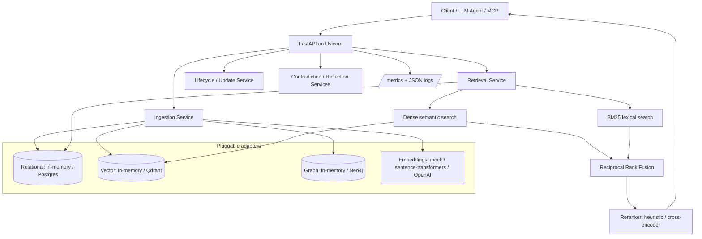

# stateful.ai

**Self-improving persistent memory for long-running LLM agents** — hybrid retrieval, versioned lifecycle, contradiction detection, reflection, **continual learning from feedback**, PII redaction, and an MCP server, built on a clean layered architecture: API → services → domain → adapters.

stateful.ai gives agents a durable memory layer that can store observations, retrieve the right context later, update stale facts, detect contradictions, **learn online which memories are actually useful**, and expose memory directly to MCP-capable tools. The primary product is a zero-infra FastAPI service that runs locally with in-memory stores and deterministic mock embeddings, then scales by swapping adapters for Postgres, Qdrant, Neo4j, real embedding models, and LLM providers.

> **What makes it different:** the memory corpus is reused as a continual-learning replay buffer, so retrieval ranking improves with use **without catastrophic forgetting** (EWC-anchored, per-tenant) — a capability no mainstream OSS memory layer ships as a complete, eval-gated stack.

## Why this exists

Long-running agents need more than chat history. They need memory that can answer questions like:

- "What did this user say they prefer?"
- "Which prior fact conflicts with this new observation?"
- "Which memories are still important, recent, or repeatedly useful?"
- "Can an agent recall this context from another app through MCP?"

stateful.ai answers those with hybrid retrieval: dense semantic search for meaning, BM25 lexical search for names and identifiers, Reciprocal Rank Fusion to merge both rankings, recency/importance/access scoring, and a second-stage reranker.

## How it compares

| | stateful.ai | Mem0 | Zep / Graphiti | Letta / MemGPT | A-MEM |
|---|---|---|---|---|---|
| Hybrid retrieval (dense + BM25 + RRF) | ✅ | partial | ✅ (graph) | — | — |
| Reranking | ✅ heuristic / cross-encoder | — | — | — | — |
| Versioned lifecycle + contradiction detection | ✅ | partial | ✅ temporal | — | — |
| **Online learning from feedback** | ✅ EWC, per-tenant | — | — | — | — |
| **Anti-forgetting eval (BWT/FWT)** | ✅ promotion gate | — | — | — | — |
| Sleep-time consolidation | roadmap | — | — | ✅ | partial |
| PII redaction at ingest | ✅ | — | — | — | — |
| MCP server | ✅ | partial | partial | ✅ | — |
| Zero-infra default | ✅ | — | — | — | ✅ |
| Zero-dep SDK + CLI | ✅ | ✅ | ✅ | ✅ | — |

This is a capability map of stateful.ai's design, not a head-to-head benchmark —
real-corpus comparison (LoCoMo / LongMemEval) is on the roadmap in
`docs/ELITE_UPGRADE.md`.

## What changed recently

**v0.3.0 — Stateful-CL: continual learning, telemetry, privacy, SDK/CLI**

- Added a **continual-learning loop**: an online, per-namespace, EWC-anchored ranking policy that adapts to feedback, a replay buffer, a `POST /feedback` endpoint, and `GET /learning/stats`. Off by default (`CONTINUAL_LEARNING_ENABLED`).
- Added a **continual-eval harness** (`scripts/continual_eval.py`) reporting Backward/Forward Transfer; EWC turns BWT ≈ −0.64 (catastrophic forgetting) into ≈ +0.20 while beating the static baseline, and acts as a promotion gate.
- Added **telemetry** for the learning loop (feedback/reward/policy/replay Prometheus series) plus retrieval-result metrics.
- Added **PII redaction at ingest** (`domain/privacy/`, email/phone/card-with-Luhn/SSN/IP/secret), config-gated via `PII_REDACTION_ENABLED`.
- Added a **zero-dependency Python SDK** (`sdk/`) and **CLI** (`apps/cli.py`).
- Test suite: **135 passing**. Design & roadmap: `docs/continual_learning_design.md`, `docs/ELITE_UPGRADE.md`.

**v0.2.0 — production hardening & glass console**

- Added **API-key auth** (`STATEFUL_AI_API_KEY`, constant-time compare), **per-client rate limiting** (token bucket, `429` + `Retry-After`), **request size limits** (`413`), and **security headers** on both services.
- Added a **consistent error envelope** (`{"error": {code, message, request_id}}`) across HTTP, validation, and unhandled errors.
- Added **`GET /api/v1/stats`** (counts by type/status, importance, access, contradictions) and a **`/health/ready` readiness probe** that checks the stores.
- Rebuilt the product UI as a **glassmorphism landing page (`/`) and live operations console (`/demo`)**: KPI cards, ingest, ranked semantic recall, version history, soft-delete, JSON export.
- Added a **security test suite** (auth, rate limiting, size limits, headers, stats).

**v0.1.0**

- Added **hybrid retrieval**: dense vector search + BM25 + Reciprocal Rank Fusion.
- Added a **lazy cross-encoder reranker** with heuristic fallback.
- Added a **zero-infrastructure FastAPI path**: in-memory relational/vector/graph stores and mock embeddings by default.
- Added an **MCP server** with `remember`, `recall`, `forget`, and `list_memories`.
- Added **Prometheus metrics** and structured request logging.
- Cleaned the repo: `.gitignore`, removed `.env`, bytecode, and egg-info artifacts.
- Reconciled dependencies into a lean core plus optional extras.
- Added focused tests for BM25/RRF, hybrid retrieval, local components, FastAPI, and the Flask demo.

## Two entry points

| | **FastAPI service** (primary product) | **Flask demo** (single-file, AWS Free Tier) |
| --- | --- | --- |
| Run | `pip install -r requirements.txt` then `uvicorn apps.api.main:app` | `pip install -r requirements-flask-demo.txt` then `flask --app apps.flask_app run` |
| Infra needed | **None** - in-memory stores + mock embeddings by default | None - local FAISS + JSON |
| Scales to | Postgres + Qdrant + Neo4j + Redis via extras / docker-compose | Single node by design |
| Code | `apps/api/`, `services/`, `domain/`, `adapters/` | `apps/flask_app.py`, `services/flask_memory_service.py` |

Use the **FastAPI service** for the main product architecture. Use the **Flask demo** for the AWS Free Tier walkthrough and portfolio demo UI.

## Quickstart: FastAPI

```bash
git clone https://github.com/Ajay-quan/stateful.ai.git
cd stateful.ai
python3 -m venv .venv
source .venv/bin/activate
pip install -r requirements.txt
uvicorn apps.api.main:app --reload
```

Open:

- API docs: `http://127.0.0.1:8000/docs`
- Health: `http://127.0.0.1:8000/health`
- Metrics: `http://127.0.0.1:8000/metrics`

The default service needs no database, vector service, graph database, queue, API key, or model download.

### FastAPI examples

```bash
BASE=http://127.0.0.1:8000

curl -s "$BASE/health"

MEMORY_ID=$(curl -s -X POST "$BASE/api/v1/ingest" \
  -H "Content-Type: application/json" \
  -d '{"user_id":"alice","text":"Alice prefers Python and FAISS for local vector search.","memory_type":"preference"}' \
  | python3 -c 'import sys,json; print(json.load(sys.stdin)["memory_id"])')

curl -s -X POST "$BASE/api/v1/retrieve" \
  -H "Content-Type: application/json" \
  -d '{"user_id":"alice","query":"local vector search","top_k":5}'

curl -s "$BASE/api/v1/memories/$MEMORY_ID"

curl -s -X POST "$BASE/api/v1/update" \
  -H "Content-Type: application/json" \
  -d '{"user_id":"alice","new_content":"Alice now prefers FastAPI services and FAISS retrieval."}'

curl -s -X POST "$BASE/api/v1/memories/list" \
  -H "Content-Type: application/json" \
  -d '{"user_id":"alice","limit":10}'

curl -s -X DELETE "$BASE/api/v1/memories/$MEMORY_ID?user_id=alice"
```

Expected response shapes:

- Ingest: `{ "memory_id", "user_id", "memory_type", "importance_score", "content_preview", "created_at" }`
- Retrieve: `{ "query", "results": [{ "rank", "memory_id", "content", "composite_score" }], "total_found", "latency_ms", "context_window" }`
- Detail: `{ "memory_id", "user_id", "content", "status", "version", "metadata", ... }`
- Update: `{ "memory_id", "action", "reason", "previous_memory_id", "content_preview" }`

## Optional backends

Install only what you need:

```bash
pip install -e ".[postgres,qdrant,neo4j,embeddings,llm,observability,mcp]"
```

Useful environment variables:

```bash
APP_ENV=production            # makes configured stores STRICT (see below)
RELATIONAL_STORE=postgres     # memory | postgres
VECTOR_STORE=qdrant           # memory | qdrant
GRAPH_STORE=neo4j             # memory | neo4j
EMBEDDING_BACKEND=openai      # mock | sentence_transformers | openai
OPENAI_API_KEY=...
RERANKER_TYPE=cross_encoder
```

The default `.env.example` keeps everything on `memory` + `mock` so a clean
checkout stays dependency-light.

**Production safety:** when `APP_ENV=production`, a configured external store
(Postgres/Qdrant/Neo4j) that is unreachable causes startup/readiness to **fail
loudly** rather than silently falling back to the non-durable in-memory store.
In development/staging it falls back with a warning. Embedding backends are now
fully aligned with the code: `mock`, `sentence_transformers`, and `openai` (the
previously-advertised `voyage` option has been removed).

## Architecture

The primary product is the **FastAPI service**, organized as API -> services -> domain -> adapters, with every external backend behind a swappable adapter (defaults run in-memory, zero infra):



The single-node **Flask demo** (`apps/flask_app.py`) is the secondary, zero-cost path used for the AWS Free Tier runbook: Flask + local FAISS + JSON canonical store on one EC2 instance. Editable diagram source: `architecture.drawio`.

## Retrieval pipeline

Retrieval (`services/retrieve_service.py`, `domain/memory/`) runs five stages:

1. Dense semantic search over-retrieves a candidate pool.
2. BM25 sparse search covers rare tokens, names, IDs, and exact keywords.
3. Reciprocal Rank Fusion merges dense and lexical rankings without comparing raw score scales.
4. Candidates are scored on semantic, lexical, recency, importance, and access signals.
5. A reranker applies diversity filtering and returns top-k memories.

The default reranker is heuristic. Set `RERANKER_TYPE=cross_encoder` with the `embeddings` extra for a lazy-loaded `cross-encoder/ms-marco-MiniLM-L-6-v2` reranker.

## MCP server

```bash
pip install -e ".[mcp]"
python -m integrations.mcp_server
```

`integrations/mcp_server.py` exposes stateful.ai to Claude Desktop, Cursor, and custom MCP clients through:

- `remember`
- `recall`
- `forget`
- `list_memories`

## Continual learning (Stateful-CL)

stateful.ai can *learn from use*. The memory corpus already is a versioned, scored,
deduplicated replay buffer — exactly what continual learning needs — so ranking
quality improves online from feedback instead of staying static. It is **off by
default** (`CONTINUAL_LEARNING_ENABLED=false`), preserving the zero-infra path.

When enabled:

- `/api/v1/retrieve` returns a `query_id` and logs the served candidates (with
  their signal features) to a bounded replay buffer.
- `/api/v1/feedback` reports whether a retrieved memory was useful; the reward is
  shaped (explicit grade + outcome + stale-memory penalty) and applied to a
  **per-namespace** learned ranking policy.
- The policy is a convex (simplex) weight vector over the five retrieval signals,
  updated online with an **EWC-style anchor** (`consolidate()` snapshots weights
  at task boundaries) so new learning does not erase old — and per-namespace
  isolation personalizes each tenant with zero cross-talk.
- `/api/v1/learning/stats` inspects the replay buffer and policy state.

```bash
export CONTINUAL_LEARNING_ENABLED=true
# retrieve -> note query_id and a memory_id, then:
curl -s -X POST "$BASE/api/v1/feedback" -H "Content-Type: application/json" \
  -d '{"query_id":"<qid>","memory_id":"<mid>","useful":true,"outcome":"success"}'
```

Evidence it works without catastrophic forgetting — the task-incremental harness
reports Backward/Forward Transfer and gates promotion:

```bash
python scripts/continual_eval.py --out docs/benchmarks
# EWC turns BWT from ~-0.64 (catastrophic forgetting) into ~+0.20, beating the
# static baseline on average P@1. See docs/benchmarks/continual_eval.md.
```

Design and roadmap: `docs/continual_learning_design.md`. Code: `domain/learning/`,
`services/feedback_service.py`.

## Python SDK & CLI

A dependency-free client (stdlib only) covers the full lifecycle including the
feedback loop:

```python
from sdk import StatefulClient

mem = StatefulClient("http://localhost:8000")          # optional api_key=...
mem.ingest("Alice prefers Python and FAISS.", user_id="alice", memory_type="fact")

hits = mem.retrieve("what does alice like?", user_id="alice")
context = mem.context_for("what does alice like?", user_id="alice")  # ready to inject

# close the continual-learning loop
mem.feedback(hits["query_id"], hits["results"][0]["memory_id"], useful=True, outcome="success")
```

Same surface from the terminal:

```bash
python -m apps.cli ingest "Alice prefers Python and FAISS." --user alice --type fact
python -m apps.cli recall "what does alice like?" --user alice
python -m apps.cli feedback <query_id> <memory_id> --useful
python -m apps.cli stats --user alice
```

## Privacy: PII redaction at ingest

Memory systems persist what they observe, so stateful.ai can scrub PII **at the
ingest boundary** — before anything is embedded, stored, or retrievable. Enable
with `PII_REDACTION_ENABLED=true`. It detects and replaces emails, phone
numbers, credit-card numbers (Luhn-validated to avoid false positives), SSNs,
IPv4 addresses, and provider secrets/tokens with typed placeholders
(`[REDACTED_EMAIL]`), and records per-category counts on the memory's metadata.
Pure stdlib, deterministic, auditable. Code: `domain/privacy/redaction.py`.

## Security & multi-tenancy

Beyond the single `STATEFUL_AI_API_KEY`, you can issue **named, revocable, scoped
keys** via `STATEFUL_AI_API_KEYS` (`name:secret[:tenant]`, comma/newline
separated). Each request is attributed to its principal, and every **mutating**
operation is written to an **audit log** exposed at `GET /api/v1/audit`
(principal, tenant, method, path, status, timestamp). Combined with the existing
constant-time auth, token-bucket rate limiting, request-size limits, and
security headers, this gives a per-consumer accountability trail.
Code: `core/security/`.

## Evaluation & benchmarks

Two complementary harnesses:

- **Retrieval quality (IR metrics):** `scripts/benchmark_memory.py` runs a
  dataset of users + gold-labeled queries through the real ingest/retrieval
  stack and reports **recall@k, MRR, nDCG@k**, with a **dense-only vs hybrid**
  ablation. A LoCoMo-style sample is bundled (`docs/benchmarks/sample_dataset.json`);
  swap in real LoCoMo/LongMemEval via the same schema.
- **Continual learning:** `scripts/continual_eval.py` reports Backward/Forward
  Transfer to prove the online policy improves without catastrophic forgetting.

## Observability

The FastAPI app exports Prometheus metrics at `/metrics` and emits structured JSON logs with request IDs. Metrics include HTTP request counts/latency, retrieval latency by mode, memories ingested, retrieval result/candidate counts, and the full Stateful-CL learning loop: feedback submissions by outcome, shaped-reward distribution, online policy updates, and replay-buffer/policy gauges (`stateful_ai_feedback_total`, `stateful_ai_feedback_reward`, `stateful_ai_cl_policy_updates_total`, `stateful_ai_cl_replay_interactions`, `stateful_ai_cl_replay_labeled_examples`, `stateful_ai_cl_policy_namespaces`). `infra/compose/docker-compose.yml` includes Prometheus + Grafana under the `observability` profile.

## Flask demo and Docker

The Flask app is the single-node demo path. It uses local FAISS + JSON persistence and powers the AWS Free Tier runbook below.

```bash
pip install -r requirements-flask-demo.txt
STATEFUL_AI_DATA_DIR=$PWD/data STATEFUL_AI_EMBEDDING_BACKEND=mock \
  flask --app apps.flask_app run --host 0.0.0.0 --port 8000
```

Docker runs the Flask demo by default:

```bash
docker build -t stateful_ai:free-tier .
docker run --rm -p 8000:8000 \
  -e STATEFUL_AI_DATA_DIR=/data/stateful_ai \
  -v "$PWD/data:/data/stateful_ai" \
  stateful_ai:free-tier
```

### Flask demo examples

```bash
BASE=http://127.0.0.1:8000

curl -s "$BASE/health"

curl -s -X POST "$BASE/api/v1/memories" \
  -H "Content-Type: application/json" \
  -d '{"user_id":"alice","key":"python-pref","content":"Alice prefers Python and FAISS for local vector search.","importance_score":0.9}'

curl -s -X POST "$BASE/api/v1/retrieve" \
  -H "Content-Type: application/json" \
  -d '{"user_id":"alice","query":"local vector search","top_k":5}'

curl -s "$BASE/api/v1/memories/key/alice/python-pref"

curl -s -X PATCH "$BASE/api/v1/memories/MEMORY_ID" \
  -H "Content-Type: application/json" \
  -d '{"content":"Alice prefers Flask APIs and FAISS retrieval."}'

curl -s "$BASE/api/v1/graph/MEMORY_ID?depth=2"
curl -s -X DELETE "$BASE/api/v1/memories/MEMORY_ID"
```

Expected response shapes:

- Ingest: `{ "memory": { "memory_id", "user_id", "content", "key" } }`
- Retrieve: `{ "query", "results": [{ "rank", "memory_id", "content", "score" }], "total_found" }`
- Hash lookup: `{ "lookup": "sha256_hash_index", "memory": {...} }`
- Graph: `{ "memory_id", "related": [{ "memory_id", "distance", "path_score", "path" }] }`
- Delete: `{ "deleted": true, "memory_id": "..." }`

## Project capabilities

- Optional Flask API-key auth with `STATEFUL_AI_API_KEY` and `X-API-Key`.
- Flask import/export endpoints for portable memory snapshots: `/api/v1/export` and `/api/v1/import`.
- Flask memory version history on update/delete: `/api/v1/memories/{memory_id}/versions`.
- Optional local persistent ChromaDB adapter in the Flask demo via `STATEFUL_AI_VECTOR_STORE=chroma`; FAISS remains the default.
- Advisory file locking and atomic JSON persistence for safer single-node demo writes.
- Product landing page at `/`, built-in browser demo UI at `/demo`, plus `scripts/demo_flask_lifecycle.sh`.
- GitHub Actions CI: `.github/workflows/ci.yml`.
- Synthetic retrieval benchmark with 10 target memories plus 60 noisy distractors: `scripts/evaluate_memory_retrieval.py`.
- Generated benchmark results and charts under `docs/benchmarks` and `docs/assets`.
- Architecture paper: `docs/stateful_ai_architecture.md`.
- ADRs: `docs/adr/`.
- OpenAPI spec: `docs/api/openapi.yaml`.
- Seeded sample data: `examples/sample_memories.json`.

Latest local benchmark summary:

| Metric | Value |
| --- | ---: |
| Memories | 70 |
| Queries | 10 |
| Precision@1 | 1.0 |
| Precision@3 | 0.5 |
| Recall@5 | 0.9667 |
| MRR | 1.0 |
| Avg latency | 10.3402 ms |
| P95 latency | 10.7547 ms |


Run the benchmark locally:

```bash
python scripts/evaluate_memory_retrieval.py --output-dir docs/benchmarks --asset-dir docs/assets
```

Run the lifecycle demo after starting the Flask app:

```bash
BASE=http://127.0.0.1:8000 ./scripts/demo_flask_lifecycle.sh
# If STATEFUL_AI_API_KEY is set on the server:
API_KEY=dev-secret BASE=http://127.0.0.1:8000 ./scripts/demo_flask_lifecycle.sh
```

Optional Flask auth and Chroma mode:

```bash
export STATEFUL_AI_API_KEY=dev-secret
export STATEFUL_AI_VECTOR_STORE=chroma  # optional; default is faiss
```

## AWS Free Tier Deployment Runbook

Do not create any AWS resource until you verify Free Tier eligibility.

Check eligibility in Console: **Billing and Cost Management -> Free Tier**. Confirm EC2 Linux hours are available for your account and region.

CLI cost check:

```bash
aws sts get-caller-identity
aws ce get-cost-and-usage \
  --time-period Start=$(date -u +%Y-%m-01),End=$(date -u +%Y-%m-%d) \
  --granularity MONTHLY \
  --metrics UnblendedCost
```

Create a $1 budget alert in Console: **Billing and Cost Management -> Budgets -> Create budget -> Cost budget -> Fixed -> $1 -> email alerts at 80% and 100%**.

CLI budget example:

```bash
ACCOUNT_ID=$(aws sts get-caller-identity --query Account --output text)
aws budgets create-budget \
  --account-id "$ACCOUNT_ID" \
  --budget '{"BudgetName":"stateful_ai-dollar-alert","BudgetLimit":{"Amount":"1","Unit":"USD"},"TimeUnit":"MONTHLY","BudgetType":"COST"}' \
  --notifications-with-subscribers '[{"Notification":{"NotificationType":"ACTUAL","ComparisonOperator":"GREATER_THAN","Threshold":80,"ThresholdType":"PERCENTAGE"},"Subscribers":[{"SubscriptionType":"EMAIL","Address":"YOUR_EMAIL@example.com"}]}]'
```

### EC2 Console Path

1. EC2 -> Key Pairs -> Create key pair -> RSA -> `.pem`.
2. EC2 -> Security Groups -> Create security group.
3. Inbound rules: SSH 22 from **My IP only**; HTTP 80 from `0.0.0.0/0`.
4. EC2 -> Launch Instance.
5. AMI: Amazon Linux 2023 or Ubuntu 22.04.
6. Instance type: `t2.micro`, or `t3.micro` only where explicitly Free Tier eligible.
7. Storage: 8 GB gp3 root volume, delete on termination.
8. Disable detailed monitoring.
9. Do not allocate Elastic IP.
10. Single region, single AZ.

Do not provision ALB, NLB, API Gateway, CloudFront, NAT Gateway, RDS, OpenSearch, managed Chroma, S3, or EFS.

### EC2 CLI Launch

```bash
REGION=us-east-1
KEY_NAME=stateful_ai-free-tier
SG_NAME=stateful_ai-free-tier-sg
MY_IP=$(curl -s https://checkip.amazonaws.com)/32
AMI_ID=ami-REPLACE_WITH_AMAZON_LINUX_2023_OR_UBUNTU_2204

aws ec2 create-key-pair --region "$REGION" --key-name "$KEY_NAME" \
  --query KeyMaterial --output text > "$KEY_NAME.pem"
chmod 400 "$KEY_NAME.pem"

VPC_ID=$(aws ec2 describe-vpcs --region "$REGION" --filters Name=is-default,Values=true --query 'Vpcs[0].VpcId' --output text)
SG_ID=$(aws ec2 create-security-group --region "$REGION" --group-name "$SG_NAME" --description "stateful.ai Free Tier demo" --vpc-id "$VPC_ID" --query GroupId --output text)
aws ec2 authorize-security-group-ingress --region "$REGION" --group-id "$SG_ID" --protocol tcp --port 22 --cidr "$MY_IP"
aws ec2 authorize-security-group-ingress --region "$REGION" --group-id "$SG_ID" --protocol tcp --port 80 --cidr 0.0.0.0/0

INSTANCE_ID=$(aws ec2 run-instances --region "$REGION" \
  --image-id "$AMI_ID" \
  --instance-type t2.micro \
  --key-name "$KEY_NAME" \
  --security-group-ids "$SG_ID" \
  --block-device-mappings '[{"DeviceName":"/dev/xvda","Ebs":{"VolumeSize":8,"VolumeType":"gp3","DeleteOnTermination":true}}]' \
  --metadata-options 'HttpTokens=required' \
  --monitoring Enabled=false \
  --count 1 \
  --query 'Instances[0].InstanceId' --output text)
aws ec2 wait instance-running --region "$REGION" --instance-ids "$INSTANCE_ID"
PUBLIC_DNS=$(aws ec2 describe-instances --region "$REGION" --instance-ids "$INSTANCE_ID" --query 'Reservations[0].Instances[0].PublicDnsName' --output text)
echo "$PUBLIC_DNS"
```

### Install Docker and Run

Amazon Linux 2023:

```bash
ssh -i stateful_ai-free-tier.pem ec2-user@$PUBLIC_DNS
sudo dnf update -y
sudo dnf install -y docker git
sudo systemctl enable --now docker
sudo usermod -aG docker ec2-user
exit
```

Reconnect:

```bash
ssh -i stateful_ai-free-tier.pem ec2-user@$PUBLIC_DNS
git clone https://github.com/Ajay-quan/stateful.ai.git
cd stateful.ai
mkdir -p /opt/stateful_ai/data
sudo chown -R ec2-user:ec2-user /opt/stateful_ai
docker build -t stateful_ai:free-tier .
docker run -d --name stateful_ai --restart unless-stopped \
  -p 80:8000 \
  -e STATEFUL_AI_DATA_DIR=/data/stateful_ai \
  -e STATEFUL_AI_EMBEDDING_BACKEND=mock \
  -v /opt/stateful_ai/data:/data/stateful_ai \
  stateful_ai:free-tier
```

Ubuntu 22.04 uses `ubuntu@$PUBLIC_DNS` and `sudo apt-get install -y docker.io git` instead of `dnf`.

## Public Endpoint Test

```bash
BASE=http://$PUBLIC_DNS
curl -s "$BASE/health"

MEM1=$(curl -s -X POST "$BASE/api/v1/memories" -H "Content-Type: application/json" -d '{"user_id":"alice","key":"python-pref","content":"Alice prefers Python and FAISS for memory retrieval."}' | python3 -c 'import sys,json; print(json.load(sys.stdin)["memory"]["memory_id"])')
MEM2=$(curl -s -X POST "$BASE/api/v1/memories" -H "Content-Type: application/json" -d "{\"user_id\":\"alice\",\"key\":\"aws-pref\",\"content\":\"Alice deploys portfolio demos on AWS Free Tier.\",\"related_memory_ids\":[\"$MEM1\"]}" | python3 -c 'import sys,json; print(json.load(sys.stdin)["memory"]["memory_id"])')

curl -s -X POST "$BASE/api/v1/retrieve" -H "Content-Type: application/json" -d '{"user_id":"alice","query":"FAISS retrieval","top_k":5}'
curl -s "$BASE/api/v1/memories/key/alice/python-pref"
curl -s "$BASE/api/v1/graph/$MEM1?depth=2"
curl -s -X DELETE "$BASE/api/v1/memories/$MEM1"
```

Use the EC2 public IPv4 DNS directly. A free `nip.io` hostname is optional. Do not use Route 53 hosted zones because they cost money. HTTPS is optional; use Caddy with Let's Encrypt on the instance only if you need it.

## Teardown Runbook

```bash
aws ec2 terminate-instances --region "$REGION" --instance-ids "$INSTANCE_ID"
aws ec2 wait instance-terminated --region "$REGION" --instance-ids "$INSTANCE_ID"
aws ec2 delete-security-group --region "$REGION" --group-id "$SG_ID"
aws ec2 delete-key-pair --region "$REGION" --key-name "$KEY_NAME"
rm -f "$KEY_NAME.pem"
```

Check leftovers:

```bash
aws ec2 describe-addresses --region "$REGION"
aws ec2 describe-volumes --region "$REGION" --filters Name=status,Values=available
aws ec2 describe-instances --region "$REGION" --filters Name=instance-state-name,Values=running,stopped
```

Looks free but can cost money: unattached Elastic IPs, NAT Gateway, load balancers, RDS, OpenSearch, managed Chroma, EFS, more than 30 GB EBS total, orphaned volumes, data transfer out beyond the free allowance, CloudWatch detailed monitoring, excessive logs, and Route 53 hosted zones.

## GitHub About Topics

Set: `python`, `fastapi`, `llm`, `agents`, `memory`, `mcp`, `vector-database`, `hybrid-search`, `bm25`, `rag`, `reranking`, `qdrant`, `postgres`, `flask`, `aws`.

## What maps to what (code pointers)

- **Hybrid retrieval (dense + BM25 + RRF)**: `domain/memory/lexical.py` (BM25, Reciprocal Rank Fusion), fused and scored in `services/retrieve_service.py` and `domain/memory/scoring.py`.
- **Reranking**: `domain/memory/reranker.py` - heuristic + diversity filtering by default, optional lazy-loaded cross-encoder with fallback.
- **Layered architecture with pluggable backends**: `apps/api/` (FastAPI), `services/`, `domain/`, `adapters/` (relational: in-memory/Postgres; vector: in-memory/Qdrant; graph: in-memory/Neo4j).
- **Runs with zero infrastructure**: `adapters/relational_store/memory_store.py` + in-memory vector/graph + mock embeddings; production backends are config-selected in `apps/api/dependencies.py`.
- **MCP server**: `integrations/mcp_server.py` (`remember`/`recall`/`forget`/`list_memories`).
- **Observability**: Prometheus `/metrics` (`core/observability/metrics.py`) and structured JSON logging (`core/logging/logger.py`).
- **Lifecycle, versioning, contradiction, reflection**: `services/update_service.py`, `services/contradiction_service.py`, `services/reflect_service.py`, `services/consolidation_service.py`.
- **Graph + hash-indexed retrieval**: `LocalMemoryGraph.traverse` and `JsonMemoryStore.get_by_key`; hot cache `HotMemoryIndex` (priority queue + hash map + recency tree).
- **Deployment**: zero-infra FastAPI (`requirements.txt`), full stack (`infra/compose/docker-compose.yml`), and the single-node Flask demo on AWS Free Tier (runbook above, `requirements-flask-demo.txt`).

## Reach me

**Ajay Varada** - [ajayvrda@gmail.com](mailto:ajayvrda@gmail.com) - [@Ajay-quan](https://github.com/Ajay-quan)

Questions, bugs, or feature ideas: open an issue or PR on the repo. Full contact details are in [`CONTACT.md`](CONTACT.md).
