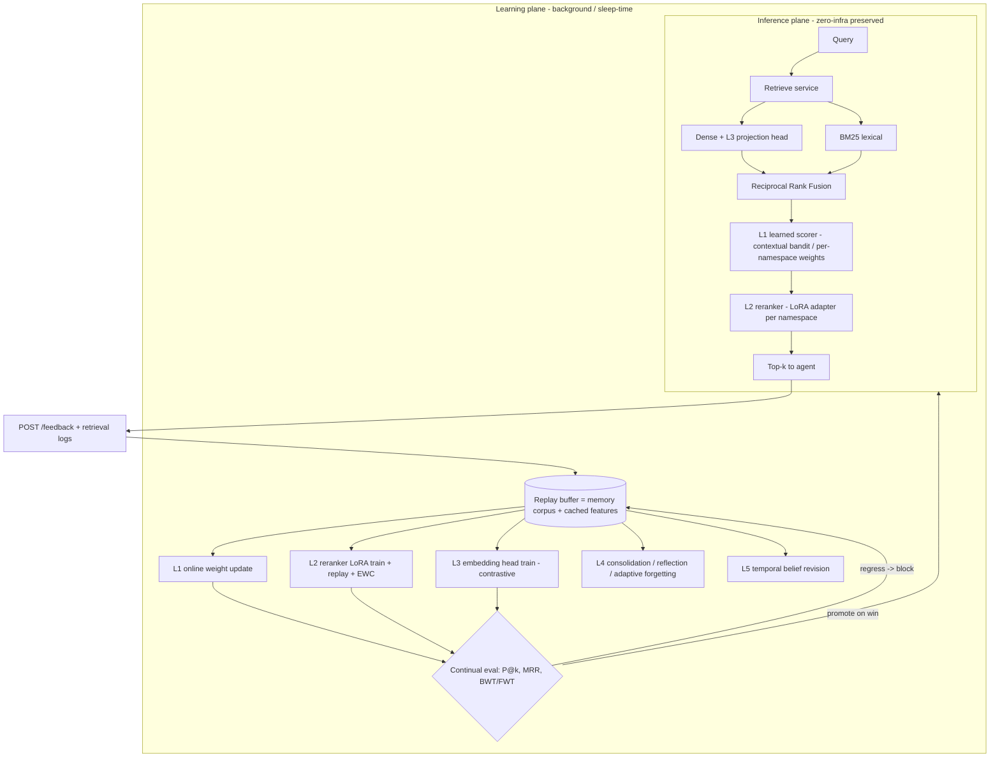

# stateful.ai Continual Learning Architecture — "Stateful-CL"

> A design brief for turning stateful.ai from a *static memory store* into a *self-improving
> memory system* that learns continually from use — without catastrophic forgetting, without
> retraining a foundation model, and without breaking the zero-infra, adapter-per-backend
> contract the project is built on.

Status: **P0 + L1 shipped in v0.3.0** (feedback substrate, replay buffer, online
EWC-anchored per-namespace ranking policy, continual-eval harness with BWT/FWT);
L2–L5 remain on the roadmap below. Author target: world-class agent-memory system.

> Shipped: `domain/learning/` (policy, replay, reward, CL metrics, registry),
> `services/feedback_service.py`, `POST /api/v1/feedback`,
> `GET /api/v1/learning/stats`, `scripts/continual_eval.py`, and tests. The
> harness shows EWC converting catastrophic forgetting (BWT ≈ −0.64) into
> positive backward transfer (≈ +0.20) while beating the static baseline on P@1.

---

## 0. Thesis: memory *is* the continual-learning substrate

Most "AI memory" products treat memory as passive storage and continual learning as a separate,
scary GPU problem. The central bet of Stateful-CL is the opposite:

**stateful.ai's memory corpus is already a structured, deduplicated, importance-scored, versioned
replay buffer.** That is exactly the object every serious continual-learning method needs.
So instead of bolting CL on, we close five nested learning loops *around the data the system
already produces*, from millisecond ranking tweaks to slow parametric adaptation — each loop
using the memory store itself as its rehearsal/replay source. This unifies the project's two
halves (the memory engine and any future learned model) under one principle and turns
catastrophic-forgetting mitigation from an add-on into a structural property.

The reframing also gives us a clean way to be **better than the current OSS field**, not just
equal to it:

| System | What it learns | What it *doesn't* | Stateful-CL's move |
|---|---|---|---|
| **Mem0** | what to extract/store (LLM-driven) | ranking weights, reranker, embeddings are fixed | learn the ranking + reranker + embedder online |
| **Zep / Graphiti** | temporal facts (bi-temporal KG) | retrieval policy is heuristic; no parametric self-improvement | add learned ranking + per-tenant adapters on top of a temporal layer |
| **Letta / MemGPT** | memory *content* via sleep-time compute | no learned retrieval model; tied to its runtime | adopt sleep-time compute **and** make retrieval itself a trained, replay-guarded model |
| **A-MEM** | memory *structure* (Zettelkasten links, note evolution) | no online ranking feedback, no parametric CL | borrow dynamic linking, add the learning loops A-MEM lacks |

The differentiator is the **full stack of loops with explicit forgetting guards (BWT/EWC) and a
continual-eval harness** — something none of the four ship today.

---

## 1. The five learning loops (fast → slow)

Think of Stateful-CL as a control system with five loops operating at different timescales. Each is
independently shippable and independently valuable; together they compound.

### L1 — Online retrieval-ranking adaptation (timescale: per query, ms)
The composite scorer in `domain/memory/scoring.py` currently uses **fixed** weights over
semantic, lexical, recency, importance, and access signals. Make those weights a **learned policy**.

- Model it as a **contextual bandit** (LinUCB / Thompson sampling) where the *context* is query
  features (length, has-identifier, namespace, memory-type mix) and the *arms* are weight vectors
  or, better, a small linear/MLP scorer producing the composite score.
- Reward = downstream usefulness signal (see §3, the Feedback API): was the retrieved memory
  actually used / cited / led to a successful agent turn? The schema already tracks
  `retrieval_count` and `successful_retrieval_count` on `MemoryItem` — that is the reward
  substrate, currently unused.
- Update online after each labeled retrieval; per-namespace weight vectors give free
  personalization. This is gradient-free, CPU-cheap, and preserves the zero-infra promise.

### L2 — Reranker continual fine-tuning (timescale: hours, offline batch)
The reranker (`domain/memory/reranker.py`) is heuristic by default with an optional frozen
`cross-encoder/ms-marco-MiniLM-L-6-v2`. Make the cross-encoder **continually fine-tuned** on the
system's own (query, memory, used?) triples.

- Train with **LoRA / PEFT adapters** on the cross-encoder so the base stays frozen — cheap,
  swappable, and (per the CL literature) LoRA *itself* reduces catastrophic forgetting versus
  full fine-tuning.
- Use **experience replay**: each training batch mixes fresh feedback triples with a sampled
  slice of historical triples drawn from the memory corpus — the most effective known defense
  against forgetting for language models. The memory store *is* the replay buffer.
- Hot-swap the adapter via config (mirrors the existing `RERANKER_TYPE` switch). Promotion is
  gated by the continual-eval harness (§4), never auto-deployed.

### L3 — Embedding-space adaptation (timescale: days)
Dense retrieval quality is capped by a frozen embedder. Instead of retraining it, learn a thin
**projection/adapter head** on top of frozen embeddings (a learned linear or 2-layer map, or a
Matryoshka-style truncation head) trained with a contrastive objective from mined
positive/negative pairs (positives = co-retrieved-and-used; hard negatives = retrieved-but-unused).

- Keeps the `EMBEDDING_BACKEND` adapter contract intact — the head wraps any backend
  (mock / sentence-transformers / OpenAI).
- Per-namespace heads = continual personalization of the *semantic space* without cross-tenant
  interference (modular CL; see §2).

### L4 — Sleep-time consolidation & reflection (timescale: idle / scheduled)
Adopt and extend **Letta's sleep-time compute**: a background worker (already scaffolded at
`apps/worker/tasks.py`) that runs when the system is idle and does the slow cognitive work:

- **Episodic → semantic consolidation** at scale (`services/consolidation_service.py`): promote
  recurring episodic observations into stable semantic facts when frequency × confidence crosses
  a learned threshold. Uses the existing `MemoryLayer.EPISODIC / SEMANTIC` distinction.
- **Reflection synthesis** (`services/reflect_service.py`, `Reflection` schema): generate
  higher-order memories ("the user consistently prefers X") with `derivation_ids` provenance and
  `refresh_after` triggers — Reflexion/Generative-Agents style.
- **A-MEM-style dynamic linking**: on consolidation, re-evaluate graph links
  (`adapters/graph_store`) so the knowledge structure *evolves* rather than freezing at insert
  time.
- **Adaptive forgetting / salience**: replace static exponential recency decay with a **learned
  decay rate per memory type**, so genuinely useful memories persist and noise fades — a true
  forgetting curve, not a fixed half-life.

### L5 — Temporal belief revision (timescale: continuous, event-driven)
Continual learning of *facts* (not parameters). When `services/contradiction_service.py` confirms
a conflict, perform **governed belief revision**: supersede with versioning (already supported via
`MemoryStatus.SUPERSEDED` + `parent_memory_ids`), bump confidence on the survivor, and record a
`MemoryUpdateDecision`. Add **bi-temporal validity** (`valid_from` / `valid_to` already exist on
`MemoryItem` and `FactRecord`) so the system models *state changes over time* — matching Zep's
best-in-class temporal correctness, but inside stateful.ai's lifecycle.

---

## 2. The headline research bet: memory-grounded modular CL (the moat)

Three ideas stack into something the OSS field does **not** have:

1. **The corpus as a universal replay buffer.** Every parametric loop (L2 reranker, L3 embedder,
   and any future learned policy/small model) draws its rehearsal data from the live memory store.
   Catastrophic forgetting is mitigated structurally because the "old task data" is never gone —
   it is the product. We additionally store **feature-level replay** (cached embeddings/logits) to
   make replay cheap (generative/feature replay from the CL literature).

2. **Per-namespace adapters = modular continual learning.** Each tenant/user/project gets its own
   small LoRA adapter (reranker) and projection head (embedder), composed at inference over a
   shared frozen base. New tenants never overwrite old ones — interference is impossible by
   construction. This is parameter-efficient *and* the cleanest known answer to multi-tenant
   forgetting, and it rides directly on the existing `namespace` field.

3. **EWC/Fisher guards on the learned weights.** For the shared components, compute a Fisher
   information penalty over the previously-good ranking/adapter weights so updates resist
   destroying what already works (EWC cut forgetting ~46% in published KG-link-prediction evals).
   Cheap to compute for the small models we are training.

Together: **a memory system that gets measurably better with use, personalizes per tenant, and is
provably resistant to forgetting** — with the replay buffer it needs already sitting in the data
plane.

Two further high-upside bets:

- **Procedural-memory / skill induction.** Mine recurring successful action sequences from
  episodic memory into reusable `MemoryType.PROCEDURE` records — the agent learns *skills*, not
  just facts. This is the least-served capability across Mem0/Zep/Letta/A-MEM.
- **A learned memory *controller* (what-to-store / what-to-forget).** Today ingestion stores
  whatever it is given. Train a lightweight policy that decides write / merge / supersede / skip
  and an importance prior from outcomes — closing the loop on the `MemoryUpdateDecision` action
  space that already exists in the schema.

---

## 3. Telemetry & the feedback substrate (prerequisite for everything)

Nothing learns without labels. The single highest-leverage first change:

- **`POST /api/v1/feedback`** — `(memory_id, query_id, used: bool | score, outcome)`. Agents
  report whether a retrieved memory was actually useful. This is the reward channel for L1–L3 and
  the training-label source for L2.
- **Retrieval logging** — persist `(query, candidates, scores, selected, outcome)` triples
  (the replay buffer in raw form). Wire into the existing Prometheus/JSON observability
  (`core/observability/metrics.py`, `core/logging/logger.py`).
- **Reward shaping** — combine explicit feedback, implicit signals (`access_count`,
  `successful_retrieval_count`), and contradiction/staleness penalties into a single scalar.

This is small, safe, and unblocks the entire program.

---

## 4. Continual-eval harness & forgetting guards (non-negotiable)

A self-modifying system without an eval guard is a liability. Extend
`scripts/evaluate_memory_retrieval.py` into a **continual-evaluation loop**:

- Track **P@k, MRR, Recall@k over time**, not once.
- Add **continual-learning metrics**: **Backward Transfer (BWT)** to detect forgetting and
  **Forward Transfer (FWT)** to confirm new learning helps. Any candidate adapter/weight set that
  regresses BWT past a threshold is **blocked from promotion**.
- **Shadow / champion-challenger deployment**: learned components serve in shadow, are scored
  against the incumbent, and only promote on a win — never auto-deploy.
- Move beyond synthetic data toward **LoCoMo / LongMemEval** (the project's own roadmap already
  names these) so claims are externally credible.

---

## 5. Target architecture



The inference plane still boots with no infrastructure and mock embeddings. Every learned
component degrades gracefully to today's heuristic defaults if its adapter is absent — preserving
the project's core promise.

---

## 6. Component / file map (where each piece lands)

| Loop / piece | New or changed | Code location |
|---|---|---|
| Feedback endpoint | new | `apps/api/routers.py`, `apps/api/schemas.py` |
| Retrieval logging | change | `services/retrieve_service.py`, `core/observability/` |
| Replay buffer store | new adapter | `adapters/replay_store/` (in-memory default, Postgres/Parquet optional) |
| L1 learned scorer | change | `domain/memory/scoring.py` + new `domain/learning/bandit.py` |
| L2 reranker LoRA + replay + EWC | change | `domain/memory/reranker.py` + new `services/learning_service.py` |
| L3 embedding head | new | `adapters/embeddings/projection_head.py` |
| L4 sleep-time loop | change | `apps/worker/tasks.py`, `services/consolidation_service.py`, `services/reflect_service.py` |
| L5 temporal/belief revision | change | `services/contradiction_service.py`, `services/update_service.py` |
| Per-namespace adapter registry | new | `adapters/adapter_registry.py` |
| Continual-eval harness | change | `scripts/evaluate_memory_retrieval.py` + `domain/evaluations/evaluator.py` |

Everything stays behind the existing adapter/service boundaries — no architectural rewrite.

---

## 7. Phased roadmap

- **P0 — Substrate (1 sprint).** Feedback API + retrieval logging + replay store + continual-eval
  harness with BWT/FWT. Ships value immediately (analytics) and unblocks all learning.
- **P1 — L1 online ranking (1 sprint).** Per-namespace learned scorer (bandit). Pure CPU,
  zero-infra, fastest measurable quality lift.
- **P2 — L2 reranker CL (2 sprints).** LoRA cross-encoder, replay-based training, EWC guard,
  champion-challenger promotion.
- **P3 — L4 sleep-time cognition (2 sprints).** Background consolidation, reflection, adaptive
  forgetting, A-MEM linking.
- **P4 — L3 embedding heads + modular per-tenant adapters + temporal belief revision (research
  track).** The moat features; gated on P0–P2 telemetry maturity.

Each phase is independently shippable and reversible.

---

## 8. Risks & safeguards

- **Feedback loops / reward hacking.** A system that learns from its own retrievals can reinforce
  its own biases. Mitigate with held-out eval sets, exploration (Thompson sampling), and
  champion-challenger gating — never promote on training reward alone.
- **Catastrophic forgetting.** Addressed structurally via replay-from-corpus + LoRA + EWC +
  per-namespace modular adapters + BWT monitoring.
- **Privacy / multi-tenant leakage.** Per-namespace adapters must never train across tenant
  boundaries; add PII redaction at ingest (already on the project's future-work list).
- **Latency.** All training is background/sleep-time; inference adds only a small learned head and
  an adapter swap. Zero-infra default path unchanged.
- **Drift / silent regression.** Continual-eval harness + shadow deploys are the circuit breaker.

---

## 9. One-paragraph pitch

> stateful.ai already stores memory as a versioned, scored, deduplicated corpus — which is precisely
> the replay buffer continual learning needs. Stateful-CL closes five nested loops around it: an
> online learned ranker, a replay-and-EWC-guarded LoRA reranker, per-tenant embedding adapters,
> sleep-time consolidation/reflection with adaptive forgetting, and temporal belief revision —
> all gated by a continual-eval harness that measures backward/forward transfer before anything
> promotes. The result is a memory system that *measurably improves with use*, *personalizes per
> tenant without cross-talk*, and is *structurally resistant to forgetting* — capabilities no
> current open-source memory framework (Mem0, Zep, Letta, A-MEM) ships as a complete stack.
```

---

### Research grounding

- Mem0 — vector + graph + KV, LLM-driven extraction; LoCoMo/LongMemEval leader on token-efficiency.
- Zep / Graphiti — bi-temporal knowledge graph, state-change modeling, temporal correctness.
- Letta / MemGPT — tiered memory + **sleep-time compute** self-improvement loop.
- A-MEM (NeurIPS 2025) — Zettelkasten agentic memory, dynamic linking, evolving note structure.
- Continual-learning core — experience replay (strongest LM defense), EWC/Fisher (~46% forgetting
  reduction), LoRA/PEFT (reduces forgetting vs full FT), generative/feature replay, BWT/FWT metrics.
